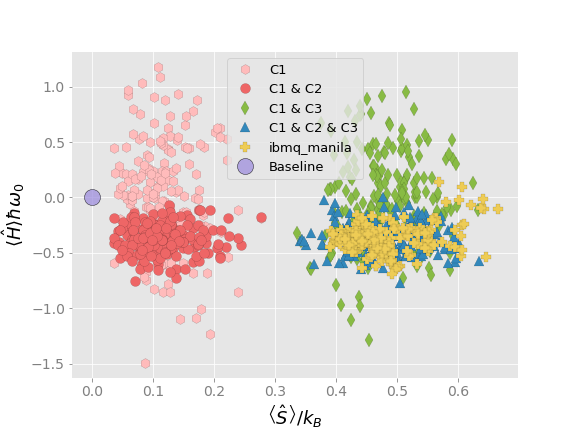

# Method for Generating Randomly Perturbed Density Operators Subject to Different Sets of Constraints

This code presents a general method for producing randomly perturbed density operators subject to different sets of constraints. The perturbed density operators are a specified “distance” away from the state described by the original density operator. This approach is applied to a bipartite system of qubits and used to examine the sensitivity of various entanglement measures on the perturbation magnitude. The constraint sets used include constant energy, constant entropy, and both constant energy and entropy. The method is then applied to produce perturbed random quantum states that correspond with those obtained experimentally for Bell states on the IBM quantum device ibmq manila. The results show that the methodology can be used to simulate the outcome of real quantum devices where noise, which is important both in theory and simulation, is present.

